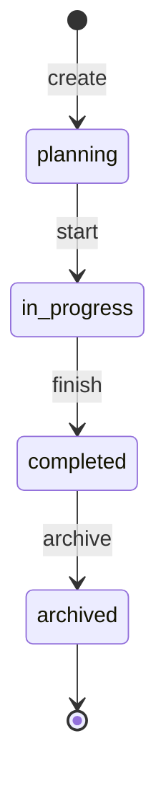
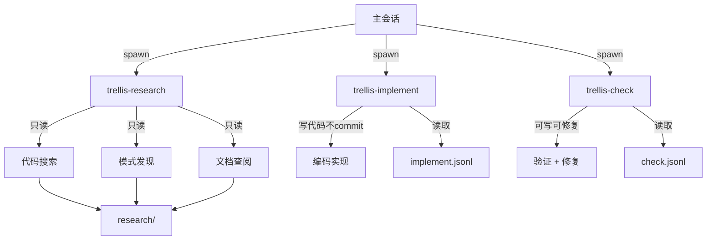
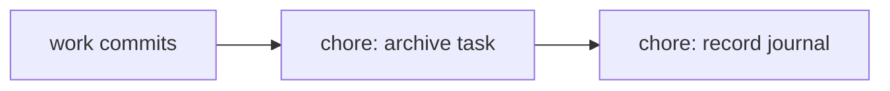
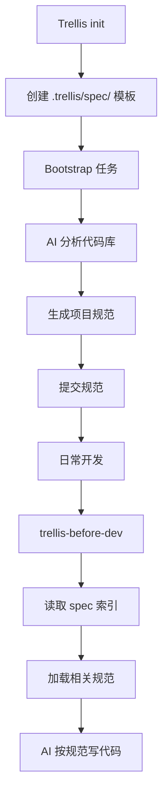
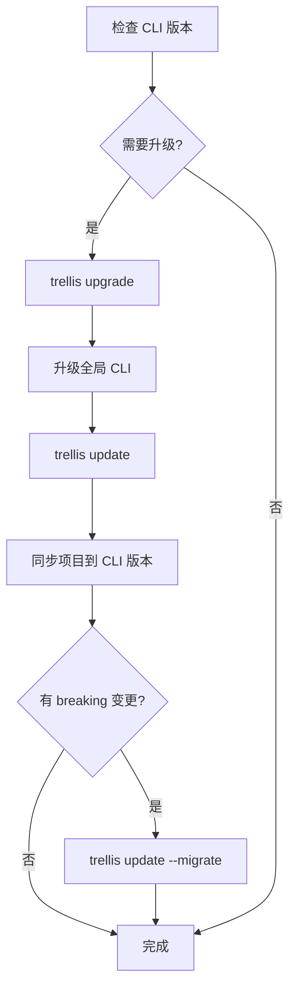

# Trellis 工作流图

## 初始化流程

```mermaid
graph TD
    A[安装 CLI] --> B[trellis init -u name --zcode]
    B --> C[新开 ZCode 会话]
    C --> D[启动 Bootstrap 任务]
    D --> E[AI 填充规范]
    E --> F[提交规范文件]
    F --> G[/trellis:finish-work]
    G --> H[开始日常开发]
```

## 日常开发流程

```mermaid
graph TD
    A[新开 ZCode 会话] --> B[描述任务]
    B --> C{AI 判断任务类型}
    C -->|简单对话| D[直接回答]
    C -->|小任务| E[询问是否创建任务]
    C -->|完整任务| F[询问是否进入 planning]

    E -->|不需要| G[Inline 执行]
    E -->|需要| F

    F -->|同意| H[Phase 1: Plan]
    F -->|拒绝| I[建议拆小任务]

    H --> J[trellis-brainstorm]
    J --> K[创建 PRD]
    K --> L{需要设计文档?}
    L -->|是| M[创建 design.md + implement.md]
    L -->|否| N[Phase 2: Execute]
    M --> N

    N --> O[trellis-before-dev]
    O --> P[加载规范]
    P --> Q[trellis-implement]
    Q --> R[编写代码]
    R --> S[trellis-check]
    S --> T{验证通过?}
    T -->|否| U[自修复]
    U --> S
    T -->|是| V[Phase 3: Finish]

    V --> W[trellis-update-spec]
    W --> X[沉淀经验到规范]
    X --> Y[提交代码]
    Y --> Z[/trellis:finish-work]
    Z --> AA[归档任务 + 记录日志]
```

## 任务生命周期



## 技能触发时机

```mermaid
graph LR
    A[创建任务] -->|trellis-brainstorm| B[澄清需求]
    B --> C[编写 PRD]
    C --> D[开始编码]
    D -->|trellis-before-dev| E[加载规范]
    E --> F[编写代码]
    F -->|trellis-check| G[验证代码]
    G --> H{通过?}
    H -->|否| I[自修复]
    I --> G
    H -->|是| J[提交代码]
    J -->|trellis-update-spec| K[沉淀经验]
    K --> L[/trellis:finish-work]
```

## 子代理协作



## Git 提交顺序



## 规范注入流程



## 升级流程


